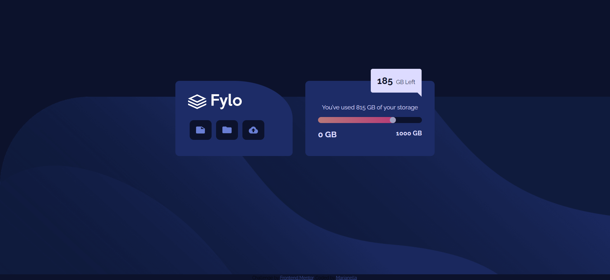

# Frontend Mentor - Fylo data storage component solution

This is a solution to the [Fylo data storage component challenge on Frontend Mentor](https://www.frontendmentor.io/challenges/fylo-data-storage-component-1dZPRbV5n). Frontend Mentor challenges help you improve your coding skills by building realistic projects. 

## Table of contents

- [Overview](#overview)
  - [The challenge](#the-challenge)
  - [Screenshot](#screenshot)
  - [Links](#links)
- [My process](#my-process)
  - [Built with](#built-with)
  - [Useful resources](#useful-resources)
- [Author](#author)

## Overview

### Screenshot

### Links

- Live Site URL: [live site](https://marianellag1.github.io/Fylo-data-fishstick/)

## My process

### Built with

- Semantic HTML5 markup
- CSS custom properties
- Flexbox
- CSS Grid

### Useful resources

- [Google](https://www.google.com) - Your friend <3
- [Code Convoy](https://codeconvey.com/css-message-box-with-arrow/) - Awesome sight which helped with arrow on the bottom of message. 
- [W3 School Sliders](https://www.w3schools.com/howto/howto_js_rangeslider.asp) - Took a while but found sliders through w3schools. I thought it was only through javascript, but really happy to expand my css knowledge!

## Author

- Frontend Mentor - [@Marianellag1](https://www.frontendmentor.io/profile/Marianellag1)

